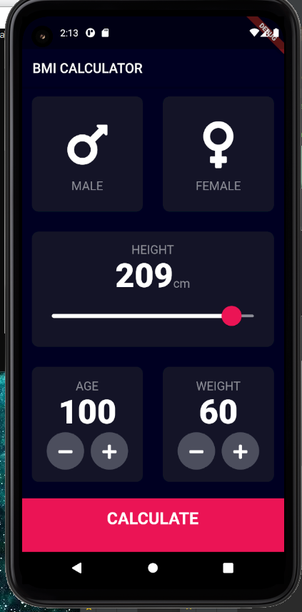
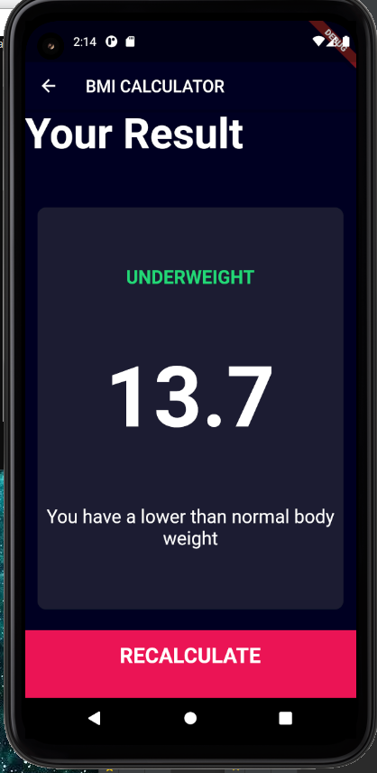

# Basic Flutter Application with beautiful UI

## Come up with basic funtion to calculate your BMI with the help of basic BMI formula:
```
BMI = kg/m2  //where kg is a person’s weight in kilograms and m2 is their height in metres squared.

```
## tools
- flutter framework
- Dart Language

## demo






